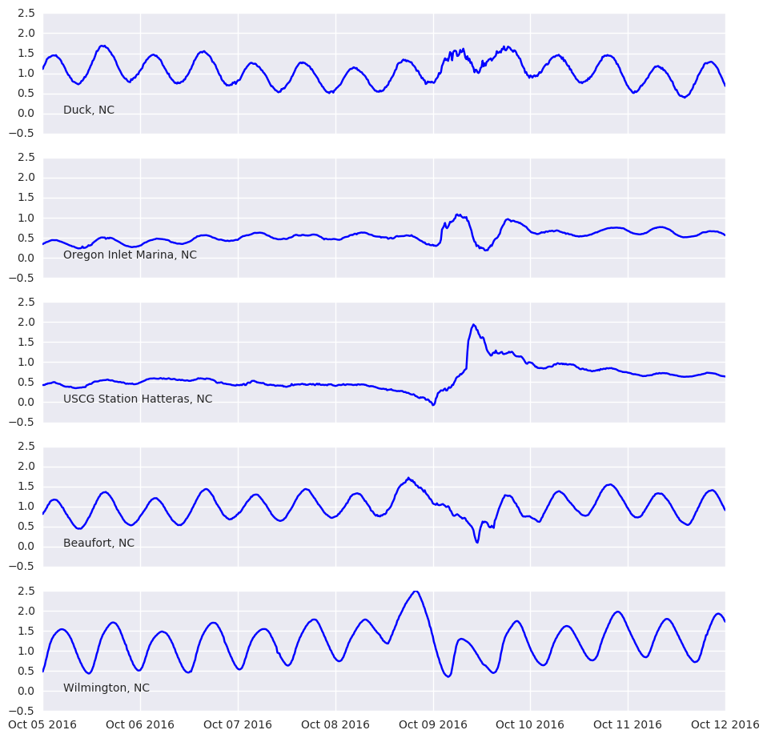

<a href="{{ site.url }}{{ site.baseurl }}/notebooks/2018-03-30-wave_height_assessment"><figcaption>Coastal Ocean Wave Height Assessment</figcaption></a>

<a href="{{ site.url }}{{ site.baseurl }}/notebooks/2018-03-15-ssh-skillscore"><figcaption>Investigating ocean models skill for sea surface height with IOOS catalog and Python</figcaption></a>

<a href="{{ site.url }}{{ site.baseurl }}/notebooks/2018-03-01-erddapy"><figcaption>erddapy: a python client/URL builder for ERDDAP</figcaption></a>

<a href="{{ site.url }}{{ site.baseurl }}/notebooks/2018-02-27-pocean-timeSeries-demo"><figcaption>Creating a CF-1.6 timeSeries using pocean</figcaption></a>

<a href="{{ site.url }}{{ site.baseurl }}/notebooks/2018-02-20-obis"><figcaption>Using r-obistools and r-obis to explore the OBIS database</figcaption></a>

<a href="{{ site.url }}{{ site.baseurl }}/notebooks/2017-12-15-finding_HFRadar_currents"><figcaption>Fetching data from a CSW catalog with Python tools</figcaption></a>

<a href="{{ site.url }}{{ site.baseurl }}/notebooks/2017-11-30-rerddap"><figcaption>Calling R libraries from Python</figcaption></a>

<a href="{{ site.url }}{{ site.baseurl }}/notebooks/2017-11-01-Creating-Archives-Using-Bagit"><figcaption>Using BagIt to tag oceanographic data</figcaption></a>

<a href="{{ site.url }}{{ site.baseurl }}/notebooks/2017-09-09-hurricane_irma"><figcaption>Exploring the NHC Advisories and Sea Surface Height during Hurricane Irma</figcaption></a>

<a href="{{ site.url }}{{ site.baseurl }}/notebooks/2017-08-01-xtractoR"><figcaption>Using the `xtractomatic` R package to track Pacific Blue Marlin</figcaption></a>

<a href="{{ site.url }}{{ site.baseurl }}/notebooks/2017-07-25-HFRadar_currents"><figcaption>Near real-time HF-Radar currents in the proximity of the Deepwater Horizon site</figcaption></a>

<a href="{{ site.url }}{{ site.baseurl }}/notebooks/2017-06-12-NCEI_RA_archive_history"><figcaption>Using NCEI geoportal REST API to collect information about IOOS Regional Association archived data</figcaption></a>

<a href="{{ site.url }}{{ site.baseurl }}/notebooks/2017-05-14-running_compliance_checker"><figcaption>Shore Station Compliance Checker Script</figcaption></a>

<a href="{{ site.url }}{{ site.baseurl }}/notebooks/2017-03-30-octave_notebook_example"><figcaption>A Matlab notebook primer</figcaption></a>

<a href="{{ site.url }}{{ site.baseurl }}/notebooks/2017-03-21-ERDDAP_IOOS_Sensor_Map"><figcaption>Read realtime data from IOOS Sensor Map via ERDDAP tabledap</figcaption></a>

<a href="{{ site.url }}{{ site.baseurl }}/notebooks/2017-01-23-R-notebook"><figcaption>Quick demonstration of R-notebooks using the r-oce library</figcaption></a>

<a href="{{ site.url }}{{ site.baseurl }}/notebooks/2017-01-18-siphon-explore-thredds"><figcaption>Exploring the THREDDS catalog with Unidata's Siphon</figcaption></a>

<a href="{{ site.url }}{{ site.baseurl }}/notebooks/2016-12-22-boston_light_swim"><figcaption>The Boston Light Swim temperature analysis with Python</figcaption></a>

<a href="{{ site.url }}{{ site.baseurl }}/notebooks/2016-12-20-searching_glider_deployments"><figcaption>Accessing glider data via the Glider DAC API with Python</figcaption></a>

<a href="{{ site.url }}{{ site.baseurl }}/notebooks/2016-12-19-exploring_csw"><figcaption>How to search the IOOS CSW catalog with Python tools</figcaption></a>

<a href="{{ site.url }}{{ site.baseurl }}/notebooks/2016-11-16-CF-UGRID-SGRID-conventions"><figcaption>Parsing Conventions and standards with Python</figcaption></a>

<a href="{{ site.url }}{{ site.baseurl }}/notebooks/2016-11-15-glider_data_example"><figcaption>Plotting Glider data with Python tools</figcaption></a>

<a href="{{ site.url }}{{ site.baseurl }}/notebooks/2016-10-12-fetching_data"><figcaption>Fetching data from CO-OPS SOS with Python tools</figcaption></a>

