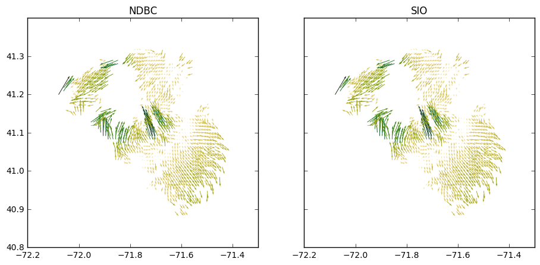
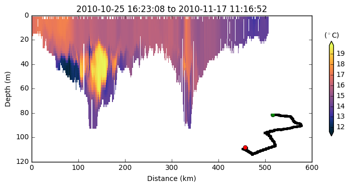

<figcaption>Using Siphon to query the NetCDF Subset Service</figcaption>

<figcaption>CF-1.6 (iris)</figcaption>

<figcaption>Demonstrate some CSW query capabilities</figcaption>

<figcaption>Glider RU22</figcaption>

<figcaption>HYCOM/glider</figcaption>

<figcaption>Siphon-ncss</figcaption>

